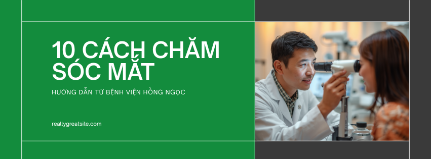
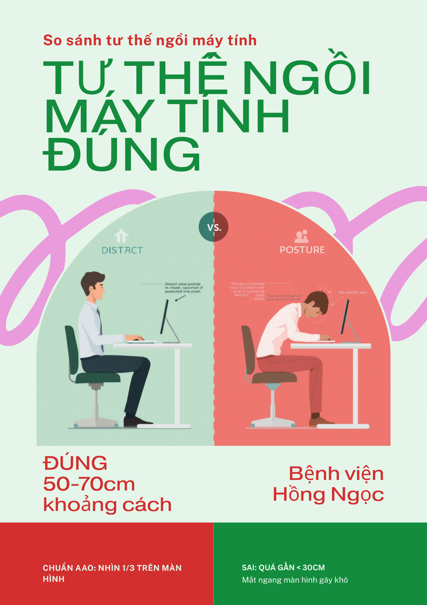
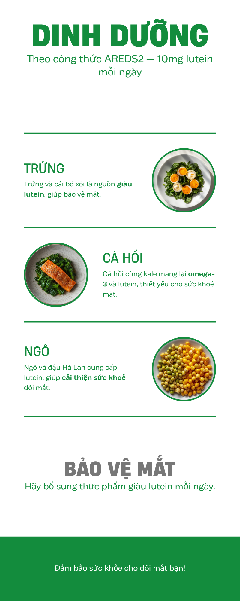
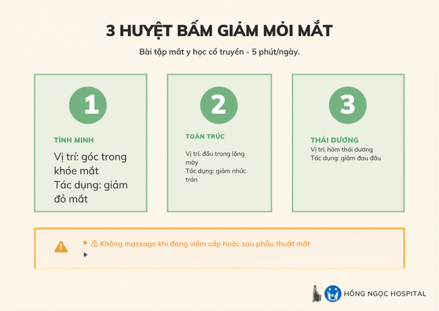
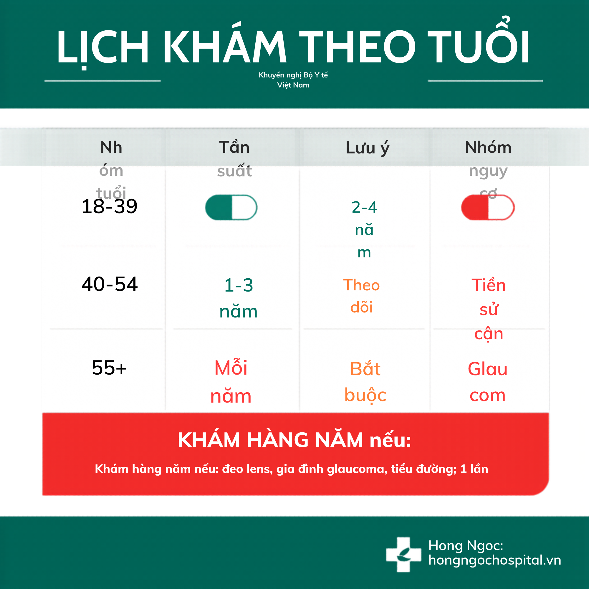
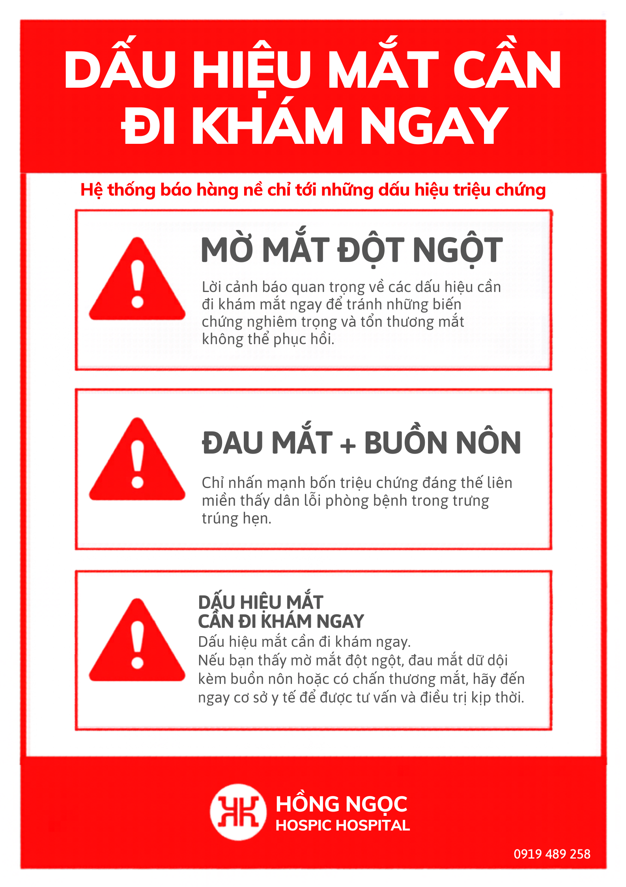

# 10 cách chăm sóc mắt sáng khỏe — Hướng dẫn từ BS chuyên khoa Mắt (2026)

> ✍ **Tác giả:** BS. [Họ Tên] — BS Chuyên khoa Mắt II, [X] năm kinh nghiệm, đã thực hiện [X,000]+ ca khám/phẫu thuật `[CTV xin info BV Hồng Ngọc]`
> 🩺 **Y khoa review:** BS. [Họ Tên] — Trưởng khoa Nhãn khoa, Bệnh viện Hồng Ngọc `[CTV xin info BV Hồng Ngọc]`
> 📅 **Cập nhật:** [DD/MM/2026] `[CTV xin info BV Hồng Ngọc]`

*Bác sĩ chuyên khoa mắt Hồng Ngọc thăm khám cho bệnh nhân*

---

## Mục lục

- [10 cách chăm sóc mắt theo khuyến nghị bác sĩ chuyên khoa](#h2-1)
- [Chăm sóc mắt theo từng đối tượng](#h2-2)
- [3 sai lầm nguy hiểm cần tránh khi chăm sóc mắt](#h2-3)
- [Khi nào cần đi khám bác sĩ ngay?](#h2-4)
- [Câu hỏi thường gặp (FAQ)](#faq)

---

## Sapo

10 **cách chăm sóc mắt** được bác sĩ khuyên dùng nhất chia ba nhóm: **tức thì khi mỏi mắt** (20-20-20, bài tập chớp mắt 3 phút/ngày, thiết lập màn hình 50–70 cm), **dinh dưỡng dài hạn** (lutein 10 mg + zeaxanthin 2 mg + omega-3 theo AREDS2), và **chăm sóc chuyên sâu** (massage huyệt, chườm ấm tuyến meibomian, outdoor 2 giờ/ngày cho trẻ).

Theo Hiệp hội Nhãn khoa Hoa Kỳ (AAO), ~**70% người làm việc > 4 giờ/ngày** với màn hình mắc [Hội chứng thị giác màn hình (CVS)](/benh-ly/hoi-chung-thi-giac-man-hinh-cvs) — do cơ mi điều tiết liên tục, tần suất chớp mắt giảm gần một nửa, và màng nước mắt bay hơi nhanh do điều hòa.

Bài tổng hợp khuyến nghị từ AAO, CDC, AREDS2 và Bộ Y tế VN, kèm cảnh báo **3 sai lầm phổ biến** có thể gây tăng nhãn áp vĩnh viễn nếu bạn đang tự ý dùng thuốc nhỏ mắt.

---

## 10 cách chăm sóc mắt theo khuyến nghị bác sĩ chuyên khoa

Mười cách sắp xếp theo **thời điểm áp dụng**: nhóm A — tức thì; nhóm B — hằng ngày; nhóm C — chuyên sâu (khô mắt mãn, cận thị tiến triển, người 40+). Đang mỏi mắt cần xử lý ngay? Đọc lướt số 1–4 trước.

### Nhóm A — Cách tức thì khi mỏi mắt giữa giờ làm

#### 1. Quy tắc 20-20-20

Khuyến nghị từ AAO + AOA: cứ **20 phút** làm việc với màn hình, nhìn ra xa **20 feet (~6 mét)** trong **20 giây**. Khi nhìn gần liên tục, cơ mi co cứng kéo dài như cơ tay cầm tạ không nghỉ — gây mỏi mắt, nhức đầu, mờ thoáng qua. Nghỉ 20 phút một lần đưa cơ mi vào chu kỳ giãn-co tự nhiên.

Cài app nhắc: **EyeCare** (iOS/Android), **Time Out** (Mac), hoặc đặt cây xanh ở mép cửa sổ làm "điểm nhìn 20 feet" cố định.

*Áp dụng quy tắc 20-20-20: nhìn xa 6m mỗi 20 phút làm việc*

#### 2. Bài tập chớp mắt 15 chu kỳ × 3 lần mỗi ngày

Kỹ thuật ba bước: **nhắm mắt** — **siết chặt mí 2 giây** — **mở to**, mỗi chu kỳ ~3 giây. Lặp lại **15 chu kỳ liên tục**, **3 lần/ngày** (sáng — trưa — chiều cuối giờ làm).

Nghiên cứu *Optimisation of blinking exercises for dry eye disease* chứng minh giảm **41% triệu chứng khô mắt** sau 4 tuần. Lý do: khi nhìn màn hình, tần suất chớp mắt giảm từ ~15 lần/phút xuống 5–7 lần/phút, phần lớn là **chớp mắt không trọn vẹn** — mí trên không chạm hẳn mí dưới — khiến lớp lipid nước mắt phân bố không đều.

> **Quote từ chuyên gia:** *"Sai lầm phổ biến nhất ở dân văn phòng là chớp mắt không trọn vẹn — cơ vòng mi không hoàn thành cycle, nước mắt phân bố không đều nên dù không khô nước, mắt vẫn cộm rát cuối ngày"* — BS. [Họ Tên] `[CTV xin info BV Hồng Ngọc]`

*Bài tập chớp mắt đầy đủ giúp giảm khô mắt cho dân văn phòng*

#### 3. Thiết lập màn hình đúng chuẩn

Khoảng cách mắt — màn hình: **50–70 cm** (một cánh tay duỗi thẳng). Vị trí: mắt nhìn vào **1/3 trên màn hình**, màn hình thấp hơn tầm mắt ~15°. Tư thế này giúp mí trên hạ tự nhiên, che bớt giác mạc, giảm diện tích bay hơi nước mắt.

Độ sáng **vừa đủ đọc không nheo mắt**, **không sáng hơn môi trường**. Thử nhanh: đưa tờ giấy trắng cạnh màn hình — nếu giấy và nền sáng tương đương là vừa. Với laptop nhỏ, kê lên giá đỡ + bàn phím rời.

*Thiết lập màn hình đúng chuẩn: 50-70cm, mắt nhìn vào 1/3 trên*

Xem thêm: [Cách set-up workspace bảo vệ mắt](/goc-tu-van/cach-set-up-workspace-bao-ve-mat).

#### 4. Tránh điều hòa và quạt thổi trực tiếp vào mặt

Luồng khí thổi thẳng vào mặt làm **màng nước mắt bay hơi nhanh gấp 2–3 lần** — gây khô, cộm, rát sau vài tiếng. Đây là lý do nhiều người lái xe đường dài hoặc ngồi điều hòa văn phòng bị khô mắt dù mắt vốn khỏe.

Khắc phục: chỉnh cánh điều hòa hướng lên **30°**, hoặc ngồi cách quạt **≥ 2 mét**. Đặt cốc nước trên bàn tăng độ ẩm cục bộ — mục tiêu **40–60% humidity** (theo AAO).

*Chăm sóc mắt cho dân văn phòng: tránh luồng khí thổi thẳng mặt*

---

> 📥 **Bạn làm việc với màn hình trên 6 giờ mỗi ngày?**
>
> Tải miễn phí **PDF "Checklist 15 mẹo cứu mắt cho dân văn phòng"** — in ra dán bàn làm việc, áp dụng ngay từ ngày mai.
>
> **[Nhập email để nhận miễn phí →](#)**

---

### Nhóm B — Dinh dưỡng và thói quen hằng ngày

#### 5. Dinh dưỡng theo công thức AREDS2

Nghiên cứu **AREDS2** (NEI Hoa Kỳ, 4,000+ người, 5 năm) xác lập công thức bộ đôi vàng bảo vệ võng mạc: **10 mg lutein + 2 mg zeaxanthin/ngày**, kết hợp omega-3 từ cá béo. Hai sắc tố này tập trung ở **điểm vàng** (macula), hoạt động như "kính râm sinh học" lọc ánh sáng xanh năng lượng cao trước khi gây tổn thương tế bào cảm thụ.

**Nguồn tự nhiên giàu lutein/zeaxanthin** (mg/100g):

| Thực phẩm | Lutein | Ghi chú |
|---|---|---|
| Cải xoăn (kale) nấu chín | ~10 mg | 1 chén = đủ liều/ngày |
| Cải bó xôi nấu chín | ~7 mg | Nấu chín hấp thu tốt hơn |
| Đậu Hà Lan | ~2.5 mg | Dễ kiếm tại VN |
| Bông cải xanh | ~1.5 mg | Ăn kèm chất béo lành mạnh |
| Ngô vàng | ~0.6 mg | Nguồn dân dã |
| Lòng đỏ trứng | ~0.3 mg | Hấp thu tốt nhất nhờ chất béo + kẽm |

Omega-3: cá hồi, cá thu, cá basa — **2 bữa/tuần** là đủ theo AAO.

> ⚠️ **Cảnh báo:** Chế độ ăn người Việt thành thị trung bình chỉ đạt **< 2 mg lutein/ngày** — thấp hơn 5 lần khuyến nghị AREDS2. Nếu ít ăn rau xanh đậm, có thể cân nhắc viên uống lutein/zeaxanthin nhưng **theo chỉ định bác sĩ** — không tự mua dùng vì có thể tương tác với thuốc đang uống.

Xem thêm: [Thực phẩm tốt cho mắt — danh sách 30 loại](/goc-tu-van/thuc-pham-tot-cho-mat).

*Dinh dưỡng tốt cho mắt: lutein 10mg + omega-3 mỗi ngày*

#### 6. Ngủ đủ 7–9 giờ và cắt thiết bị 30–60 phút trước ngủ

Mắt **phục hồi chủ yếu trong giấc ngủ**: nước mắt cơ bản được bổ sung, vi tổn thương biểu mô giác mạc được sửa chữa, nhãn áp hạ tự nhiên. Ánh sáng xanh từ điện thoại / máy tính / TV **ức chế melatonin** → khó ngủ → mắt mỏi hôm sau → vòng lặp. CDC Hoa Kỳ khuyến nghị **7–9 giờ/đêm**. Mẹo: bật **Night Shift / Dark Mode** sau 20h, đọc sách giấy thay vì điện thoại trước ngủ, để điện thoại sạc ngoài phòng ngủ.

#### 7. Đeo kính chống tia UV 99–100% khi ra nắng

Tia UV gây **đục thủy tinh thể**, **thoái hóa điểm vàng do tuổi (AMD)**, và **bỏng giác mạc** khi nhìn vào nguồn UV mạnh (hàn xì, tuyết phản chiếu, biển trưa nắng).

Tiêu chí chọn kính râm — không phải càng đen càng tốt:

- Tem **CE** hoặc **ANSI Z80.3** ghi chặn **99–100% UVA + UVB** (hoặc "UV400")
- Tròng polarized nếu lái xe / gần nước, biển
- Gọng trùm thái dương khi leo núi / trượt tuyết
- Tránh kính râm vỉa hè giá rẻ — không có lớp chống UV, kính tối làm **đồng tử giãn nhận nhiều ánh sáng hơn**, vào tăng UV cả khi không đeo kính

Xem thêm: [Dịch vụ đo mắt, đo độ cận tại Hồng Ngọc](/dich-vu/do-mat-may-may-trac-do-can).

---

### Nhóm C — Chăm sóc chuyên sâu

#### 8. Massage mắt và day ấn 3 huyệt (5 phút mỗi ngày)

Massage huyệt quanh mắt giúp **tăng tuần hoàn vi mạch** quanh nhãn cầu, giảm co cứng cơ trán và cơ vòng mi sau giờ làm dài.

**Ba huyệt vị chính:**

- **Tình Minh** (Jingming): góc trong khóe mắt, sát sống mũi — giảm mỏi mắt, đỏ mắt nhẹ
- **Toản Trúc** (Cuanzhu): đầu trong lông mày, chỗ giáp sống mũi — giảm nhức trán do căng thẳng mắt
- **Thái Dương** (Taiyang): hõm thái dương hai bên, giữa đuôi mắt và chân tóc mai — giảm đau đầu hai bên do nhìn màn hình lâu

**Kỹ thuật:** dùng đầu ngón trỏ, ấn nhẹ — giữ **5 giây** — thả, lặp **5 lần mỗi huyệt**, lực vừa phải (hơi tức là đủ, không đau). Tổng ~5 phút, làm cuối giờ trưa hoặc trước ngủ.

> ⚠️ **Warning — Không massage huyệt mắt khi:**
> - Đang viêm kết mạc cấp (mắt đỏ, có ghèn, chảy nước)
> - Vừa phẫu thuật mắt trong vòng **3 tháng**
> - Đang đeo kính áp tròng (tháo ra trước khi massage)
> - Có tiền sử bong võng mạc hoặc cận thị nặng > 6 độ (cần hỏi bác sĩ trước)

*Bài tập chăm sóc mắt: day ấn 3 huyệt Tình Minh, Toản Trúc, Thái Dương*

#### 9. Outdoor time 2 giờ mỗi ngày — đặc biệt cho trẻ em

Paper **Lancet 2022**: trẻ em ngoài trời **≥ 2 giờ/ngày** giảm **23% nguy cơ cận thị tiến triển** so với trẻ chỉ ở trong nhà [Lancet 2022 — Outdoor time and myopia]. Cơ chế: ánh sáng tự nhiên (~10,000 lux, gấp 100 lần đèn phòng) kích thích **dopamine võng mạc** — chất ức chế sự kéo dài bất thường của trục nhãn cầu, nguyên nhân chính của cận thị tiến triển.

**Quy tắc 1-2-10 cho thời gian màn hình của trẻ** (khuyến nghị AAO):

| Độ tuổi | Thời gian màn hình tối đa |
|---|---|
| Dưới 2 tuổi | **0 phút** (trừ video call gia đình) |
| 2–5 tuổi | **dưới 1 giờ/ngày** |
| 6–12 tuổi | **dưới 2 giờ/ngày** (ngoài giờ học online) |

Nếu trẻ phải học online, áp dụng 20-20-20 nghiêm ngặt + 30 phút outdoor sau mỗi 2 tiếng học.

Xem thêm: [Khám mắt trẻ em — kiểm soát cận thị học đường](/dich-vu/kham-mat-tre-em-can-thi-hoc-duong).

*Trẻ em cần 2 giờ ngoài trời mỗi ngày để phòng cận thị học đường*

#### 10. Chườm ấm tuyến meibomian (10 phút mỗi ngày — cho người khô mắt mãn)

Nếu bạn khô mắt mãn dù đã nhỏ nước mắt nhân tạo nhiều lần/ngày, vấn đề có thể ở **chất lượng** chứ không phải lượng. Lớp ngoài cùng nước mắt là **lipid** tiết từ **tuyến meibomian** dọc bờ mi. Tuyến tắc → dầu không đủ → nước mắt bay hơi nhanh dù vẫn tiết bình thường.

**Cách chườm ấm chuẩn (Tear Film & Ocular Surface Society):**

- **Nhiệt độ:** 38–42°C (ấm như nước tắm em bé — chạm cổ tay không nóng rát)
- **Thời gian:** 10 phút liên tục
- **Dụng cụ:** khăn nhúng nước ấm, **eye mask gel** hâm microwave 15–20 giây, hoặc bowl nước ấm úp mặt (nhắm mắt)
- **Tần suất:** 1–2 lần/ngày, đặc biệt trước ngủ
- Sau khi chườm, **massage nhẹ bờ mi từ trong ra ngoài** giúp dầu meibum tan, chảy ra

> ⚠️ **Warning — Không chườm ấm khi:**
> - Đang **viêm kết mạc cấp** hoặc viêm bờ mi nhiễm khuẩn (chườm làm nhiễm khuẩn lan)
> - Vừa **phẫu thuật mắt** (LASIK, Phaco, mổ chắp lẹo) trong vòng 1 tháng
> - Đang đeo **kính áp tròng** (tháo ra trước khi chườm, đeo lại sau 30 phút)
> - Mắt bị bỏng nhiệt / hóa chất chưa lành

Xem thêm: [Khô mắt mãn tính — nguyên nhân, điều trị](/benh-ly/kho-mat-man-tinh).

---

## Chăm sóc mắt theo từng đối tượng

Nguyên tắc chung 10 cách trên áp dụng cho mọi người, nhưng bốn nhóm sau cần lưu ý thêm điểm riêng do sinh lý và mức rủi ro khác nhau.

### Trẻ em và học sinh — phòng cận thị học đường

Outdoor **≥ 2 giờ/ngày** (đã nói ở cách #9) + khoảng cách đọc sách **30 cm** (Quy tắc Harmon) + đèn bàn **60–75 lux**, nguồn sáng từ **trái** nếu trẻ thuận tay phải.

Lịch khám: **1 năm/lần** nếu chưa cận, **6 tháng/lần** nếu đã đeo kính. Khám gấp khi: nheo mắt xem TV, ngồi sát màn hình, nhức đầu sau giờ học, kêu chữ trên bảng mờ.

Cận thị phát hiện sớm có thể **kiểm soát tiến triển** bằng **atropine 0.01–0.05%** hoặc **Ortho-K** — giảm 50–60% tốc độ tăng độ.

Xem thêm: [Kiểm soát cận thị trẻ em — Atropine, Ortho-K](/dich-vu/kiem-soat-can-tre-em-atropine-ortho-k).

### Dân văn phòng và học sinh-sinh viên — phòng CVS

Phần lớn biện pháp đã cover ở Nhóm A. Bổ sung: nếu khô mắt **> 4 lần/tuần**, dùng **nước mắt nhân tạo không chất bảo quản** (preservative-free) dạng ống đơn liều — tránh dạng chai nhiều liều vì BAK dùng dài hạn gây độc giác mạc.

**Tuyệt đối không tự mua thuốc nhỏ mắt có corticoid** (xem Sai lầm #1). Nếu khô mắt kéo dài > 2 tuần dù đã chườm ấm + nước mắt nhân tạo, đi khám tìm nguyên nhân.

### Người đeo kính áp tròng — bảo vệ giác mạc

Người đeo lens thuộc nhóm **nguy cơ cao** viêm giác mạc do vi khuẩn / nấm / Acanthamoeba — có thể loét giác mạc, mất thị lực vĩnh viễn. Bốn nguyên tắc bắt buộc:

- **Vệ sinh tay + rửa lens ≥ 1 lần/ngày** bằng multi-purpose solution; KHÔNG dùng nước máy / nước cất tự pha muối
- **Không đeo lens khi ngủ** — kể cả lens "ngủ được" — trừ khi BS chỉ định Ortho-K
- **Tối đa 8–10 giờ/ngày**, có ngày nghỉ chuyển sang kính gọng
- **Tháo ngay khi:** đỏ, cộm, mờ, nhạy sáng, chảy nước mắt nhiều — đi khám trong 24h nếu triệu chứng không hết

Khám mắt **hằng năm** bất kể tuổi nếu đeo lens, kể cả khi không triệu chứng.

### Người trên 40 tuổi — phòng lão thị và đục thủy tinh thể

Sau tuổi 40, **khả năng điều tiết thủy tinh thể giảm dần** (quy luật sinh lý) — khó đọc chữ gần, phải đẩy điện thoại xa hơn. Nguy cơ **đục thủy tinh thể** và **thoái hóa điểm vàng** tăng đáng kể.

Lịch khám: **1 năm/lần** từ 40–54, **6 tháng/lần** từ 55+. Tăng cường lutein + zeaxanthin theo AREDS2 đặc biệt quan trọng cho nhóm này. Dấu hiệu khám gấp: **mờ mắt đột ngột**, **"ruồi bay" tăng nhanh đột ngột**, **quầng sáng** quanh nguồn sáng (nghi tăng nhãn áp).

Xem thêm: [Điều trị lão thị PresbyMAX](/dich-vu/dieu-tri-lao-thi-presbymax).

---

## 3 sai lầm nguy hiểm cần tránh khi chăm sóc mắt

### Sai lầm #1 — Tự ý dùng thuốc nhỏ mắt có corticoid

Corticoid giảm đỏ — sưng — ngứa rất nhanh nên nhiều người tự mua, dùng kéo dài hàng tuần — hàng tháng. Biến chứng:

- **Glaucoma do steroid** — tăng nhãn áp ở ~30% người dùng kéo dài; không triệu chứng nhưng làm tổn thương dây thần kinh thị giác, có thể **mất thị lực vĩnh viễn**
- **Đục thủy tinh thể sớm** — kích hoạt đục dạng cực sau (PSC) khi dùng > 3 tháng
- **Làm nặng nhiễm trùng mắt** — nếu nguyên nhân đỏ mắt là virus / vi khuẩn / nấm, corticoid ức chế miễn dịch tại chỗ → nhiễm trùng lan, có thể loét giác mạc

**Nhận biết thuốc nhỏ mắt có corticoid** — đọc thành phần hoạt chất trên vỏ hộp, tránh tên chứa:

- **-sone** (dexamethasone, betamethasone, prednisolone)
- **-solon** (methylprednisolone)
- **fluorometholone** (FML)

> **Quote từ chuyên gia:** *"Tại phòng khám của tôi, ~1 trong 5 ca khô mắt mãn đến khám có tiền sử dùng corticoid kéo dài tự mua. Đáng tiếc vài ca đã tổn thương dây thần kinh thị giác không hồi phục"* — BS. [Họ Tên] `[CTV xin info BV Hồng Ngọc]`

Theo *J Clin Optom 2025*, tự ý dùng corticoid OTC là vấn đề sức khỏe cộng đồng cần can thiệp khẩn cấp ở các nước thu nhập trung bình [J Clin Optom 2025].

### Sai lầm #2 — Tin thông tin sai trên mạng xã hội

Quảng cáo "**chữa khỏi cận thị không phẫu thuật**" trên TikTok, Facebook, YouTube ngày càng phổ biến — bài tập "đảo mắt 360°", viên uống "tan độ", máy massage hồng ngoại. Chưa có PubMed hay clinical trial uy tín nào chứng minh các phương pháp này hồi phục cận thị.

Cách kiểm tra trước khi tin:

- Tìm `"<sản phẩm>" + research` hoặc `+ clinical trial` trên **PubMed**
- Kiểm tra **FDA approval** (Hoa Kỳ) / **CE marking** (Châu Âu)
- Xem profile người quảng cáo: **bác sĩ chuyên khoa Mắt thật** hay influencer sức khỏe chung
- Cảnh giác câu "khỏi sau X ngày" — cận thị là biến đổi cấu trúc nhãn cầu, không hồi phục sau vài ngày

Xem thêm: [Lật mặt 5 tin đồn chăm sóc mắt trên TikTok](/blog/lat-mat-5-tin-don-cham-soc-mat-tren-tiktok).

### Sai lầm #3 — Chỉ đi khám khi mắt mờ hoặc đau

**Glaucoma** (tăng nhãn áp mãn) và **thoái hóa điểm vàng** đều diễn tiến **không triệu chứng** trong giai đoạn đầu — khi bạn thấy "mắt vẫn nhìn được", tổn thương dây thần kinh thị giác có thể đã không hồi phục.

**Tần suất khám mắt định kỳ theo Bộ Y tế Việt Nam:**

| Độ tuổi | Tần suất khám |
|---|---|
| 18–39 tuổi | 2–4 năm/lần |
| 40–54 tuổi | 1–3 năm/lần |
| 55–64 tuổi | 1–2 năm/lần |
| Từ 65 tuổi | Mỗi năm 1 lần |

**Khám hằng năm bất kể tuổi** nếu bạn thuộc nhóm: đeo kính áp tròng, tiền sử gia đình glaucoma, tiểu đường, tăng huyết áp, hoặc đang dùng corticoid kéo dài.

> **Quote từ chuyên gia:** *"Một bệnh nhân nữ 52 tuổi đến khám vì mờ một mắt — nhãn áp 38 mmHg (bình thường < 21), thị trường mất 70% mắt phải, glaucoma giai đoạn 3 không hồi phục. Bệnh nhân không khám mắt suốt 5 năm vì 'không thấy đau gì'"* — BS. [Họ Tên] `[CTV xin info BV Hồng Ngọc]`

*Lịch khám mắt theo tuổi: từ 18 đến 65+ theo khuyến nghị Bộ Y tế*

---

> 🩺 **Bạn đang dùng thuốc nhỏ mắt nhưng không rõ thành phần?**
>
> Hoặc bị khô mắt — đỏ mắt kéo dài hơn 2 tuần?
>
> **Đặt lịch khám miễn phí 15 phút** với BS chuyên khoa Mắt Hồng Ngọc — không bán hàng, không gợi ý phẫu thuật, chỉ tư vấn an toàn dựa trên tình trạng mắt thực tế.
>
> **[Đặt lịch ngay →](#)**

---

## Khi nào cần đi khám bác sĩ ngay?

Sáu dấu hiệu **không tự xử lý tại nhà** — phải đi khám trong **24–48 giờ**:

- 🚨 **Mờ mắt đột ngột** (vài giờ đến 1 ngày, không hồi phục sau nghỉ)
- 🚨 **Đau mắt dữ dội kèm buồn nôn** (nghi tăng nhãn áp cấp — cấp cứu)
- 🚨 **Chớp sáng / "ruồi bay" tăng nhanh đột ngột** (nghi bong võng mạc)
- 🚨 **Nhìn đèn có quầng sáng** (nghi glaucoma góc đóng)
- 🚨 **Chấn thương mắt** — kể cả nhẹ (UV hàn xì, dị vật, va đập)
- 🚨 **Đỏ mắt > 3 ngày** không hết kèm chảy nước mắt / mủ / nhạy sáng

> **Quote từ chuyên gia:** *"Có bệnh lý nhãn khoa cửa sổ điều trị vàng chỉ 6–24 giờ — như bong võng mạc hoặc tắc động mạch trung tâm võng mạc. Đến muộn vài tiếng = mất thị lực vĩnh viễn"* — BS. [Họ Tên] `[CTV xin info BV Hồng Ngọc]`

*6 dấu hiệu mắt cần đi khám bác sĩ ngay — đừng chủ quan*

Xem thêm: [Cấp cứu nhãn khoa 24/7 tại Hồng Ngọc](/dich-vu/cap-cuu-nhan-khoa-24-7).

---

## Câu hỏi thường gặp (FAQ)

### 1. Có nên dùng thuốc nhỏ mắt nhân tạo mỗi ngày không?

Có, nhưng chỉ **nước mắt nhân tạo không chất bảo quản** (preservative-free), **< 4 lần/ngày**. Tránh thuốc có corticoid (xem Sai lầm #1). Nếu phải dùng > 4 lần/ngày, đi khám tìm nguyên nhân gốc — tắc meibomian, thiếu vitamin A, hoặc tác dụng phụ thuốc kháng histamin / chống trầm cảm. Theo Mayo Clinic, nước mắt nhân tạo có BAK dùng kéo dài có thể gây độc giác mạc [Mayo Clinic].

### 2. Đeo kính lọc ánh sáng xanh có thực sự cần thiết?

Không bắt buộc. **Cochrane Review 2023** (tổng hợp 17 nghiên cứu) kết luận kính lọc blue light **không giảm đáng kể mỏi mắt kỹ thuật số** so với kính thường [Cochrane 2023]. Có thể hữu ích nếu dùng máy tính buổi tối (sau 19h) — giảm ánh sáng xanh hỗ trợ giấc ngủ. Quan trọng hơn vẫn là 20-20-20 và thiết lập màn hình đúng chuẩn.

### 3. Bao lâu nên đi khám mắt một lần?

Theo Bộ Y tế VN: **18–39**: 2–4 năm/lần; **40–54**: 1–3 năm/lần; **55–64**: 1–2 năm/lần; **≥ 65**: mỗi năm. Người đeo kính áp tròng, tiền sử gia đình glaucoma, tiểu đường, tăng huyết áp: **hằng năm** bất kể tuổi. Trẻ đã có cận: **6 tháng/lần**. Đang dùng corticoid kéo dài: đo nhãn áp 3 tháng/lần.

### 4. Tại sao tôi vẫn khô mắt dù uống nhiều nước?

Khô mắt mãn ở dân văn phòng phần lớn không liên quan lượng nước uống — mà do **tuyến meibomian tắc**. Tuyến này tiết lipid ngoài cùng nước mắt giúp **nước mắt không bay hơi**. Tuyến tắc → dầu không đủ → nước mắt vẫn tiết bình thường nhưng bay hơi quá nhanh — nên bạn vẫn khô mắt dù uống 2 lít/ngày. Giải pháp: **chườm ấm 10 phút/ngày** (cách #10) + massage bờ mi.

### 5. Có thực phẩm nào "tăng độ" mắt cận hoặc hồi phục cận thị không?

**KHÔNG.** Theo **American Academy of Ophthalmology (AAO)**, chưa có thực phẩm hay viên uống nào được chứng minh **hồi phục cận thị**. Cận thị là biến đổi cấu trúc nhãn cầu (trục nhãn cầu dài bất thường) — vấn đề cơ học, không phải thiếu dinh dưỡng. Lutein, zeaxanthin, omega-3 chỉ **bảo vệ võng mạc** dài hạn, không "tăng/giảm độ". Cận thị hiện chỉ kiểm soát được bằng **atropine** (trẻ em), **Ortho-K**, hoặc **phẫu thuật khúc xạ** (LASIK, SmartSight, ICL). Vui lòng **tham khảo bác sĩ chuyên khoa Mắt trước khi dùng viên uống bổ mắt** — nhiều sản phẩm chứa vitamin A liều cao có thể gây độc gan nếu dùng dài hạn.

---

## Kết luận — 3 điều quan trọng nhất nhớ

1. ⏰ **Quy tắc 20-20-20 + bài tập chớp mắt 3 phút/ngày** — bắt đầu ngay hôm nay, không tốn tiền, hiệu quả thấy được sau 2 tuần.
2. 🥗 **Lutein 10 mg + omega-3 từ cá béo 2 bữa/tuần + ngủ 7–9 giờ** — đầu tư dài hạn cho võng mạc, đặc biệt quan trọng sau tuổi 40.
3. 🚫 **KHÔNG tự mua thuốc nhỏ mắt có corticoid** (tên chứa "-sone", "-solon", "dexamethasone", "fluorometholone") — rủi ro tăng nhãn áp, đục thủy tinh thể, mất thị lực vĩnh viễn.

Chăm sóc mắt là quá trình dài hạn — không có "thần dược" nào thay thế lifestyle đúng và khám định kỳ.

---

> **Còn câu hỏi về thị lực của bạn?**
>
> 📞 **Hotline tư vấn miễn phí:** 0919 489 258
>
> 🏥 **Đặt lịch khám miễn phí 15 phút** với BS chuyên khoa Mắt tại Bệnh viện Hồng Ngọc — **[Đặt lịch online →](#)**
>
> **Hồng Ngọc** là đơn vị tiên phong tại Việt Nam về điều trị tật khúc xạ (LASIK, SmartSight, Phaco) và ghép giác mạc. Cam kết **5 năm tái khám miễn phí** sau phẫu thuật, quy trình thăm khám chuẩn quốc tế.
>
> Xem thêm: [Dịch vụ LASIK / SmartSight](/dich-vu/dieu-tri-tat-khuc-xa) · [Khám mắt tổng quát](/dich-vu/kham-mat-tong-quat) · [Bệnh lý Glaucoma](/benh-ly/glaucoma)

---

## Về tác giả

**BS. [Họ Tên]** — Bác sĩ Chuyên khoa Mắt II, Trung tâm Mắt BV Hồng Ngọc. Tốt nghiệp ĐH Y Hà Nội năm [năm], tu nghiệp phẫu thuật khúc xạ tại Singapore. [X] năm kinh nghiệm, đã thực hiện hơn **[X,000] ca** LASIK, Phaco, ghép giác mạc. `[CTV xin info BV Hồng Ngọc]`

**[📅 Đặt lịch khám với BS →](#)**

---

## Reference

- **AAO** — American Academy of Ophthalmology: https://www.aoa.org/healthy-eyes/caring-for-your-eyes
- **AOA** — American Optometric Association: https://www.aoa.org/healthy-eyes/eye-deserve-more
- **CDC** Sleep Recommendations: https://www.cdc.gov/sleep/about/index.html
- **NEI** — AREDS2 study: https://www.nei.nih.gov/research/clinical-trials/age-related-eye-disease-studies-aredsareds2
- **Cochrane Review 2023**: https://www.cochrane.org/about-us/news/blue-light-filtering-spectacles
- **Mayo Clinic** — Dry Eyes: https://www.mayoclinic.org/diseases-conditions/dry-eyes
- Bộ Y tế Việt Nam — khuyến nghị khám mắt định kỳ
- **Lancet 2022** — Outdoor time and myopia progression `[CTV verify DOI]`
- *Optimisation of blinking exercises for dry eye disease* `[CTV verify DOI]`
- ***J Clin Optom 2025*** — OTC steroid eye drops: https://journals.lww.com/jcor/fulltext/2025/10000/urgent_need_to_curb_over_the_counter_steroid_eye.30.aspx
- Tear Film & Ocular Surface Society guideline (chườm ấm meibomian)

---

> **Image credits:** 6 brand assets gen qua Canva MCP (`v2-hero`, `v2-c2-areds2`, `v2-c3-red-flags`, `v3-b1-posture`, `v3-b2-acupressure`, `v3-c4-timeline`) + 4 stock images từ Pexels free license (photo IDs: 5483249, 5752287, 1586996, 4885131).
